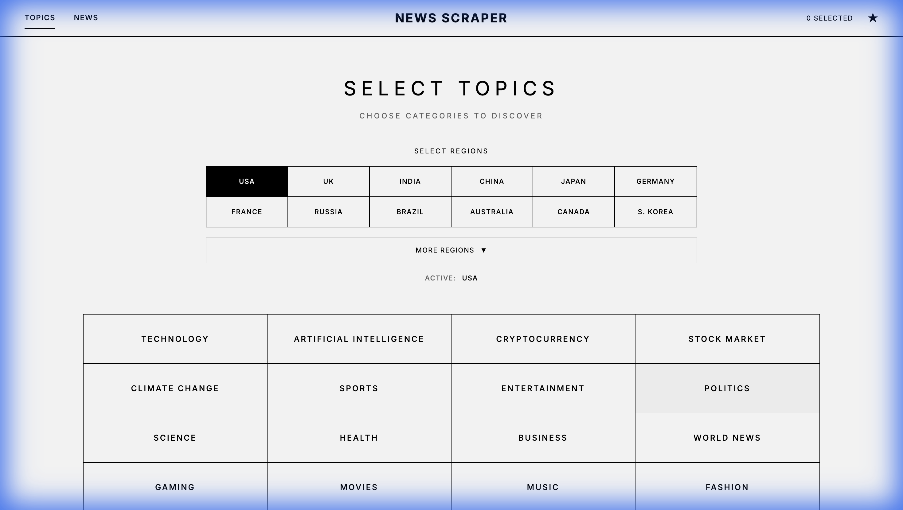
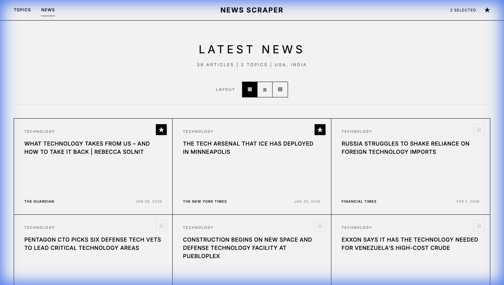
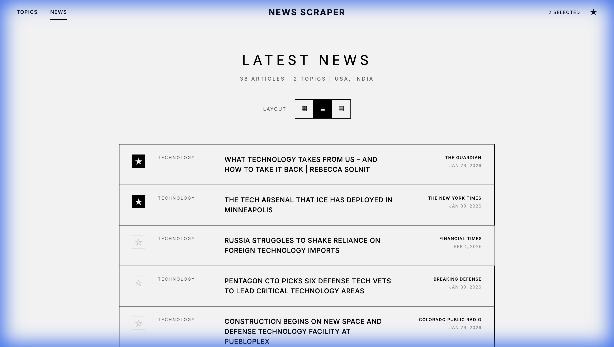

# Minimalist News Scraper

A no-nonsense news aggregator that cuts through the noise. Pick your topics, get the headlines, save what matters. No algorithmic feeds, no clickbait recommendations, no endless scrolling traps.

## Screenshots

### Topic Selection
Pick from 20 categories or add your own. No account required, no preferences to configure.



### News Grid View
Headlines from multiple sources, organized and scannable. Click any article to read the full story.



### List View
Prefer a denser format? Switch layouts with one click.



## Why This Exists

Most news apps want your attention. This one respects your time.

- **No infinite scroll** - You see what you asked for, nothing more
- **No algorithmic feed** - You choose the topics, not an algorithm
- **No tracking** - Runs entirely in your browser, no analytics
- **No account** - Open the page and start reading
- **No ads** - Clean interface, zero distractions

## Features

### Web Interface
- **40+ regions** - Select news from USA, UK, India, China, Japan, and more
- **Multi-region support** - Aggregate news from multiple countries at once
- **20 preset categories** covering tech, business, sports, entertainment, and more
- **Custom topics** for niche interests (just type and add)
- **Three layouts** - Grid for scanning, List for reading, Compact for power users
- **Star articles** to save them for later (stored locally in your browser)
- **Direct links** to original sources, no interstitial pages

### Python CLI
For automation and batch processing:
- Interactive topic selection
- Export to CSV with full metadata
- Automatic deduplication across topics
- Run it on a schedule with cron

## Quick Start

### Web Interface
Open `index.html` in any browser. That's it.

### Python CLI
```bash
pip install -r requirements.txt
python scraper.py
```

## Project Structure

```
├── index.html          Web interface
├── styles.css          Stylesheet (high-fashion minimalist design)
├── app.js              Frontend logic
├── scraper.py          Python CLI
├── requirements.txt    Python dependencies
├── screenshots/        Interface screenshots
└── trending_news.csv   Output file (generated by CLI)
```

## Data Sources

Articles are fetched from Google News RSS feeds. Each article includes:
- Headline
- Source publication
- Topic category
- Publication date
- Direct link to original article

## Tech Stack

- Vanilla HTML/CSS/JavaScript (no frameworks, no build step)
- Python 3 with feedparser
- Google News RSS

## License

MIT
